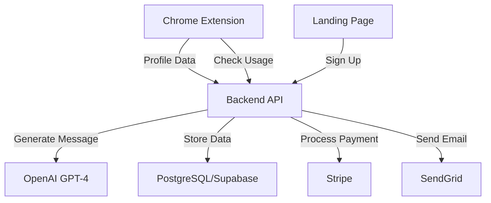

# NetworkIQ Technical Architecture

## 🏗️ System Overview



## 🎯 MVP Architecture (Launch in 7 Days)

### Chrome Extension (2 days)
```javascript
manifest.json
├── content_scripts/
│   ├── linkedin_parser.js    // Extract profile data
│   ├── score_calculator.js   // Calculate NetworkIQ score
│   └── ui_injector.js       // Show score overlay
├── popup/
│   ├── popup.html           // Extension popup
│   ├── popup.js             // Settings & account
│   └── styles.css           // Styling
├── background/
│   └── service_worker.js    // API calls, auth
└── utils/
    ├── api_client.js        // Backend communication
    └── storage.js           // Local data management
```

### Backend API (1 day)
```python
# FastAPI Structure (Python)
backend/
├── main.py                  # FastAPI app
├── routers/
│   ├── auth.py             # User authentication
│   ├── profiles.py         # Profile scoring
│   ├── messages.py         # Message generation
│   └── payments.py         # Stripe integration
├── models/
│   ├── user.py            # User model
│   ├── profile.py         # Profile scoring model
│   └── subscription.py    # Payment model
├── services/
│   ├── openai_service.py  # GPT-4 integration
│   ├── stripe_service.py  # Payment processing
│   └── email_service.py   # Email notifications
└── database/
    └── connection.py       # Supabase/PostgreSQL
```

## 📦 Database Schema

```sql
-- Users table
CREATE TABLE users (
    id UUID PRIMARY KEY DEFAULT gen_random_uuid(),
    email VARCHAR(255) UNIQUE NOT NULL,
    name VARCHAR(255),
    background_data JSONB, -- User's resume/background
    subscription_tier VARCHAR(50) DEFAULT 'free',
    stripe_customer_id VARCHAR(255),
    created_at TIMESTAMP DEFAULT NOW(),
    updated_at TIMESTAMP DEFAULT NOW()
);

-- Profiles scored
CREATE TABLE scored_profiles (
    id UUID PRIMARY KEY DEFAULT gen_random_uuid(),
    user_id UUID REFERENCES users(id),
    linkedin_url VARCHAR(500),
    profile_data JSONB,
    score INTEGER,
    score_breakdown JSONB,
    created_at TIMESTAMP DEFAULT NOW()
);

-- Messages generated
CREATE TABLE messages (
    id UUID PRIMARY KEY DEFAULT gen_random_uuid(),
    user_id UUID REFERENCES users(id),
    profile_id UUID REFERENCES scored_profiles(id),
    message_text TEXT,
    template_used VARCHAR(100),
    sent BOOLEAN DEFAULT FALSE,
    accepted BOOLEAN DEFAULT FALSE,
    created_at TIMESTAMP DEFAULT NOW()
);

-- Usage tracking
CREATE TABLE usage_logs (
    id UUID PRIMARY KEY DEFAULT gen_random_uuid(),
    user_id UUID REFERENCES users(id),
    action VARCHAR(50), -- 'score', 'generate_message', etc.
    credits_used INTEGER DEFAULT 1,
    created_at TIMESTAMP DEFAULT NOW()
);

-- Subscription table
CREATE TABLE subscriptions (
    id UUID PRIMARY KEY DEFAULT gen_random_uuid(),
    user_id UUID REFERENCES users(id),
    stripe_subscription_id VARCHAR(255),
    status VARCHAR(50), -- 'active', 'cancelled', 'past_due'
    current_period_end TIMESTAMP,
    created_at TIMESTAMP DEFAULT NOW()
);
```

## 🔑 API Endpoints

### Authentication
```
POST /api/auth/signup
POST /api/auth/login
GET  /api/auth/user
POST /api/auth/logout
```

### Profile Scoring
```
POST /api/profiles/score
{
  "linkedin_url": "https://linkedin.com/in/username",
  "profile_html": "<parsed HTML>",
  "user_background": {...}
}

Response:
{
  "score": 85,
  "breakdown": {
    "alumni_match": 30,
    "company_match": 25,
    "skills_match": 20,
    "location_match": 10
  },
  "top_connections": ["USAFA 2012", "Former C3 AI", "Denver based"]
}
```

### Message Generation
```
POST /api/messages/generate
{
  "profile_id": "uuid",
  "tone": "professional",
  "purpose": "networking"
}

Response:
{
  "message": "Hi [Name], I noticed we're both USAFA grads...",
  "alternative_versions": [...],
  "credits_used": 1
}
```

### Payment
```
POST /api/payments/create-checkout
GET  /api/payments/subscription-status
POST /api/payments/cancel-subscription
POST /api/payments/webhook (Stripe webhook)
```

## 🚀 Deployment Architecture

### Option 1: Serverless (Recommended for MVP)
```yaml
Frontend:
  - Chrome Extension: Chrome Web Store
  - Landing Page: Vercel
  
Backend:
  - API: Vercel Functions (Python)
  - Database: Supabase (PostgreSQL)
  - File Storage: Vercel Blob
  
Services:
  - Auth: Supabase Auth
  - Payments: Stripe
  - Email: SendGrid
  - Analytics: PostHog
```

### Option 2: Traditional (For Scale)
```yaml
Frontend:
  - Chrome Extension: Chrome Web Store
  - Landing Page: Netlify
  
Backend:
  - API: DigitalOcean App Platform
  - Database: DigitalOcean PostgreSQL
  - Redis: DigitalOcean Redis (caching)
  
Services:
  - Auth: Auth0
  - Payments: Stripe
  - Email: SendGrid
  - CDN: Cloudflare
```

## 🔐 Security Considerations

### Data Protection
- No storing of LinkedIn HTML/data
- Only store parsed, anonymized insights
- User data encrypted at rest
- HTTPS everywhere
- JWT tokens with short expiry

### Rate Limiting
```python
# Per user limits
FREE_TIER_LIMITS = {
    "daily_scores": 10,
    "daily_messages": 5,
    "storage_profiles": 100
}

PRO_TIER_LIMITS = {
    "daily_scores": 1000,
    "daily_messages": 100,
    "storage_profiles": 10000
}
```

### Compliance
- GDPR compliant (EU users)
- CCPA compliant (California)
- No LinkedIn ToS violations
- Clear privacy policy
- User data deletion on request

## 📈 Scaling Strategy

### Phase 1: MVP (0-1,000 users)
- Single API server
- Supabase free tier
- Manual customer support

### Phase 2: Growth (1,000-10,000 users)
- Add Redis caching
- CDN for static assets
- Automated email onboarding
- Intercom for support

### Phase 3: Scale (10,000+ users)
- Kubernetes cluster
- Multiple API instances
- Dedicated database cluster
- 24/7 monitoring
- Dedicated support team

## 🧪 Testing Strategy

### Chrome Extension Testing
```javascript
// tests/
├── unit/
│   ├── parser.test.js
│   ├── scorer.test.js
│   └── storage.test.js
├── integration/
│   ├── api.test.js
│   └── linkedin.test.js
└── e2e/
    └── full_flow.test.js
```

### Backend Testing
```python
# tests/
├── unit/
│   ├── test_scoring.py
│   ├── test_messages.py
│   └── test_payments.py
├── integration/
│   ├── test_api.py
│   └── test_database.py
└── load/
    └── test_performance.py
```

## 🚨 Monitoring & Analytics

### Key Metrics to Track
```javascript
// Mixpanel/PostHog events
track('extension_installed')
track('profile_scored', {score: 85, breakdown: {...}})
track('message_generated', {profile_id: 'xxx'})
track('message_copied')
track('subscription_started', {plan: 'pro'})
track('subscription_cancelled', {reason: 'too_expensive'})
```

### Error Monitoring
- Sentry for error tracking
- LogRocket for session replay
- Uptime monitoring with Better Uptime

## 💰 Payment Integration (Stripe)

### Quick Implementation
```python
# 1. Create Stripe checkout session
@app.post("/api/create-checkout-session")
async def create_checkout_session(user_id: str):
    session = stripe.checkout.Session.create(
        payment_method_types=['card'],
        line_items=[{
            'price': 'price_xxxxx',  # Your price ID
            'quantity': 1,
        }],
        mode='subscription',
        success_url='https://networkiq.ai/success',
        cancel_url='https://networkiq.ai/cancel',
        client_reference_id=user_id
    )
    return {"url": session.url}

# 2. Handle webhook
@app.post("/api/stripe-webhook")
async def stripe_webhook(request: Request):
    # Verify webhook signature
    # Update user subscription status
    # Grant access to pro features
```

## 🚀 Launch Checklist

### Day 1-2: Chrome Extension
- [ ] LinkedIn profile parser
- [ ] Scoring algorithm
- [ ] UI overlay
- [ ] Local storage

### Day 3: Backend API
- [ ] FastAPI setup
- [ ] User authentication
- [ ] Score endpoint
- [ ] Message generation endpoint

### Day 4: Payment Integration
- [ ] Stripe account setup
- [ ] Checkout flow
- [ ] Webhook handling
- [ ] Subscription management

### Day 5: Landing Page
- [ ] Hero section
- [ ] Pricing table
- [ ] Sign up flow
- [ ] Dashboard

### Day 6: Testing
- [ ] Extension testing
- [ ] API testing
- [ ] Payment flow testing
- [ ] Cross-browser testing

### Day 7: Launch
- [ ] Chrome Web Store submission
- [ ] ProductHunt preparation
- [ ] First 10 beta users
- [ ] Monitoring setup

---

**Total Development Time**: 7 days to paid MVP
**Total Cost**: <$100 (using free tiers)
**Break-even**: 5 paying customers